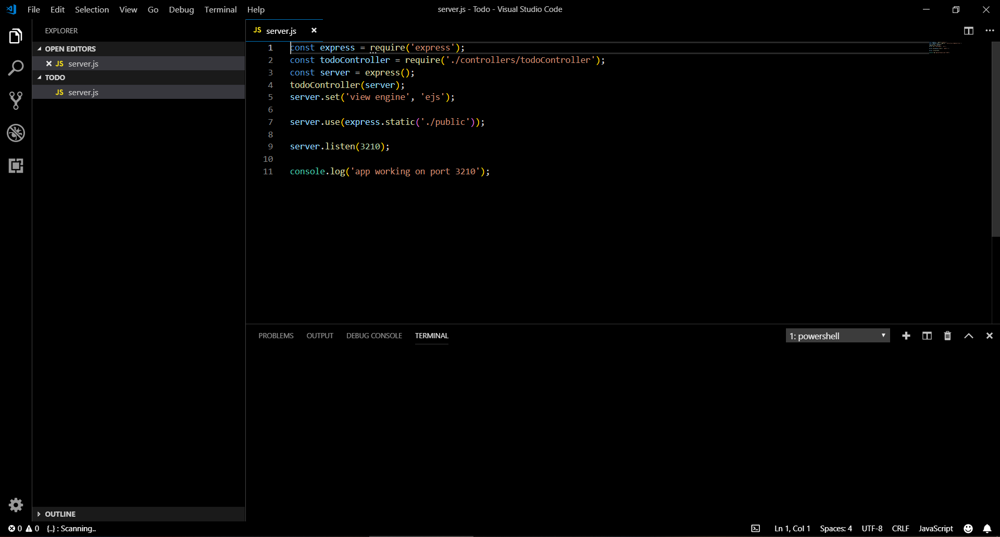

# Simple Black Theme

This theme for Visual Studio Code adds a simple dark black theme.

# Installation

1. Open Extensions sidebar panel in Visual Studio Code. View → Extensions
2. Search for Simple Black Theme
3. Click Install
4. Click Reload

# Usage

In order to use the theme follow these steps:
> File → Preferences → Color Theme → Simple Black Theme.
>
> Keyboard Shortcut: Ctrl+K Ctrl+T then select the theme and go!

# Authors

Made with ❤️ by **Mohammed Hassan Aldosari** follow me in [Twitter](https://twitter.com/mhwdosari)

Enjoy 😄